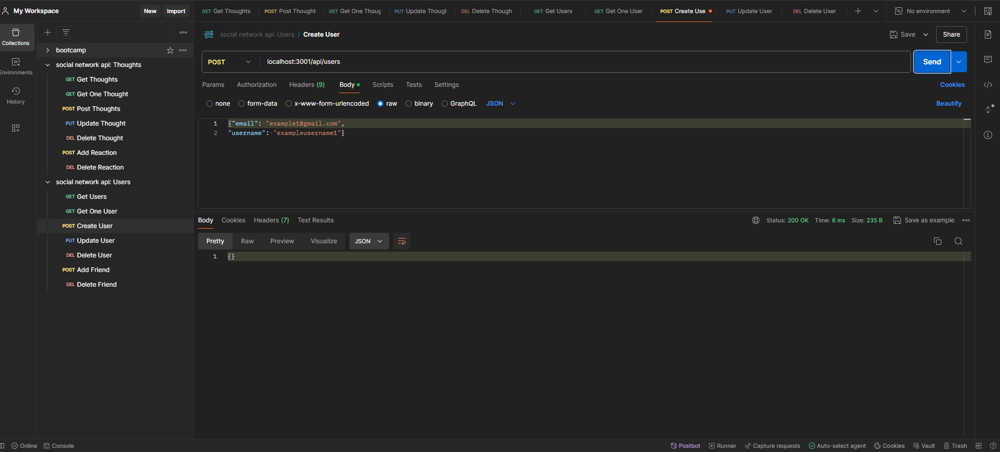

# Social Network API with NoSQL
  Created by Bethany Proctor 

  ## Description
  The purpose of this project is to provide a space for users to share their thoughts, react to their friends' thoughts, and create a friends list. Built with Express.js and Mongoose, this project was a great exercise in building APIs and preparing this coder for future work with MongoDB, opening the door for more full-stack applications to be created.

  ## Table of Contents
  * [Installation](#installation)
  * [Usage](#usage)
  * [Credits](#credits)
  * [Contact Me](#contact-me)
  

  ## Installation
  The dependencies of this project include Express.js, Mongoose, and dayJs.

  ## Usage
  Because this application is not deployed and only features a back-end, the user will need to use Insomnia or Postman to interact with it. The user can create an account with their email and chosen username while using a `POST` route. They can also find other users with a `GET` route, update their user using a `PUT` route, and delete their user using a `DELETE` route if they choose to. They can also interact with friends by following and unfollowing other users. Users can post, update, and delete their thoughts, as well as react to the thoughts of other users. 
   
   
  Watch the walkthrough video of the app <a href="">here</a>.
   
   

   
   
  Languages : JavaScript

  ## Credits
  N/A

  ## Contact Me
  Find me on GitHub: BethanyProctor
  
